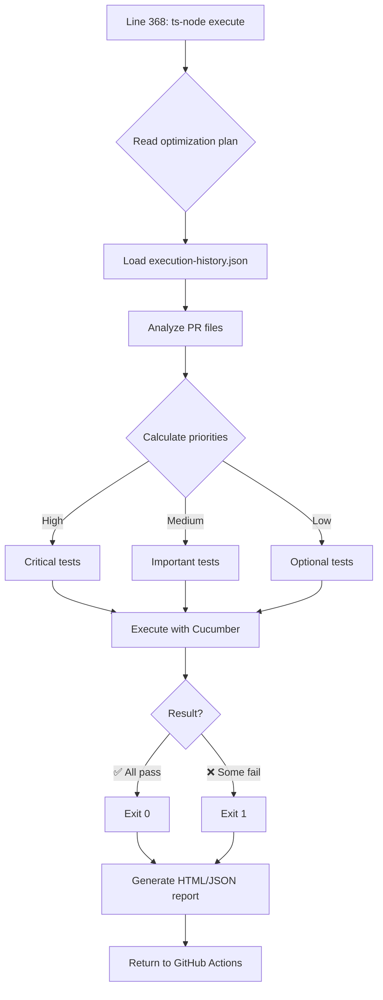
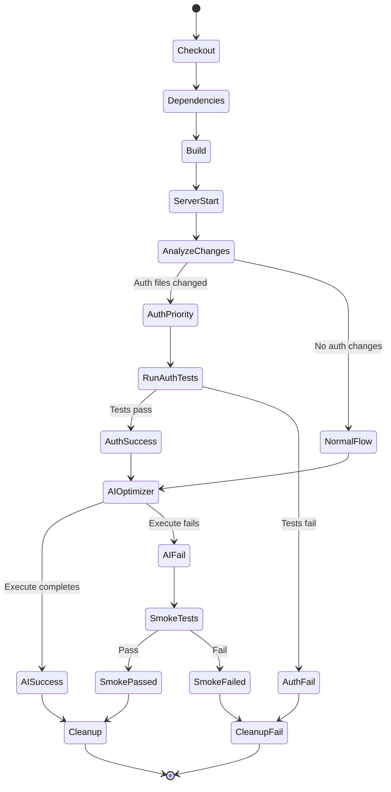
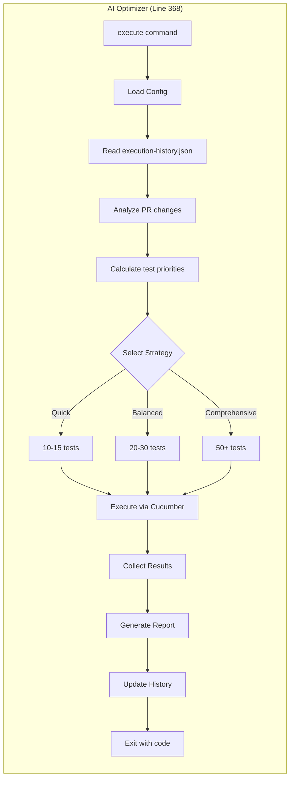

# PR Validation Workflow - Sequence Diagram

## 🔄 Complete Workflow Flow

```mermaid
sequenceDiagram
    participant Dev as Developer
    participant GH as GitHub Actions
    participant Git as Git
    participant AI as AI Test Optimizer
    participant Server as Express Server
    participant Tests as Test Suite
    
    Dev->>GH: Creates/Updates PR
    activate GH
    
    Note over GH: 📥 Checkout & Setup
    GH->>Git: Checkout PR code
    Git-->>GH: Code downloaded
    GH->>GH: Install Node.js 18
    GH->>GH: npm ci (dependencies)
    GH->>GH: Install Playwright browsers
    
    Note over GH: 🏗️ Build Phase
    GH->>GH: npm run build:server
    GH->>GH: npm run build:client
    GH->>GH: Verify build artifacts
    
    Note over GH,Server: 🚀 Server Startup
    GH->>Server: node dist/server/index.js
    activate Server
    Server-->>GH: Server PID
    GH->>Server: Health check (15 attempts)
    Server-->>GH: ✅ Ready
    
    Note over GH,Git: 🔍 Change Analysis
    GH->>Git: git diff base..head --name-only
    Git-->>GH: List of modified files
    
    alt Auth Files Changed
        Note over GH,Tests: 🔐 Priority: Authentication
        GH->>AI: optimize balanced
        AI-->>GH: Optimization plan
        
        GH->>Tests: npm run test:auth
        activate Tests
        Tests-->>GH: Results (23 scenarios)
        deactivate Tests
        
        alt Auth Tests PASS
            Note over GH,AI: 🤖 Line 368 - Execute AI Optimizer
            GH->>AI: ts-node execute
            activate AI
            AI->>AI: Read optimized plan
            AI->>AI: Select additional tests
            AI->>Tests: Execute selected tests
            activate Tests
            Tests-->>AI: Results
            deactivate Tests
            AI-->>GH: ✅ Completed
            deactivate AI
        else Auth Tests FAIL
            Note over GH: ⚠️ End with summary
            GH-->>Dev: ❌ PR needs corrections
        end
        
    else No Auth Changes
        Note over GH,AI: 🤖 Line 368 - Direct Execution
        GH->>AI: optimize balanced
        AI-->>GH: Plan generated
        
        GH->>AI: ts-node execute
        activate AI
        AI->>AI: Analyze PR changes
        AI->>AI: Decide relevant tests
        AI->>Tests: Execute optimized tests
        activate Tests
        Tests-->>AI: Results
        deactivate Tests
        
        alt AI Tests PASS
            AI-->>GH: ✅ Success
            deactivate AI
        else AI Tests FAIL
            AI-->>GH: ⚠️ Fallback required
            deactivate AI
            
            Note over GH,Tests: 🔥 Fallback: Smoke Tests
            GH->>Tests: npm run test:smoke
            activate Tests
            Tests-->>GH: Basic results
            deactivate Tests
        end
    end
    
    Note over GH,Server: 🛑 Cleanup
    GH->>Server: kill SERVER_PID
    deactivate Server
    GH->>GH: Clean temporary files
    
    GH-->>Dev: 📊 Final report
    deactivate GH
```

## 🎯 Critical Point: Line 368



## 📋 Workflow States



## 🔍 Detail: AI Test Optimizer Execute



## 📊 Workflow Metrics

| Phase | Average Time | Notes |
|-------|--------------|-------|
| Checkout & Setup | 1-2 min | Includes dependencies |
| Build | 2-3 min | Server + Client |
| Server Start | 30-45 sec | With health checks |
| Auth Tests | 3-5 min | If auth changes present |
| AI Optimizer (line 368) | 2-8 min | Depends on selected tests |
| Cleanup | 10-15 sec | Stop server + cleanup |
| **Total** | **8-18 min** | Varies by changes |

## 🎨 Legend

- 🔐 Priority authentication flow
- 🤖 AI Test Optimizer execution
- 🔥 Fallback to smoke tests
- ✅ Success / Happy path
- ❌ Failure / Needs correction
- ⚠️ Warning / Continues with limitations
