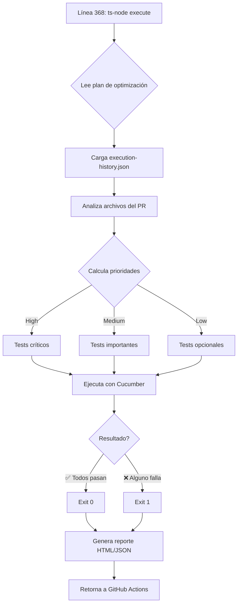
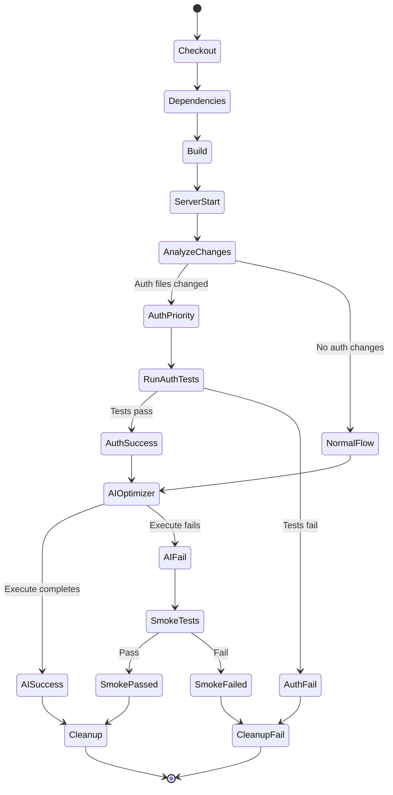
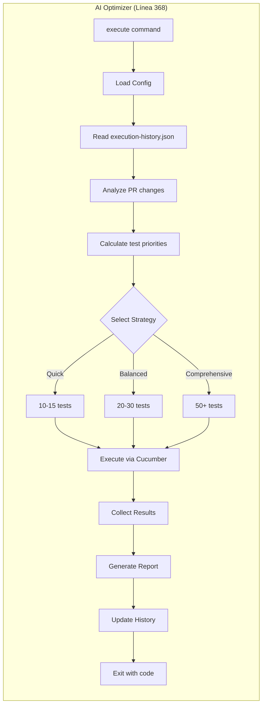

# PR Validation Workflow - Diagrama de Secuencia

## 🔄 Flujo Completo del Workflow

```mermaid
sequenceDiagram
    participant Dev as Developer
    participant GH as GitHub Actions
    participant Git as Git
    participant AI as AI Test Optimizer
    participant Server as Express Server
    participant Tests as Test Suite
    
    Dev->>GH: Crea/Actualiza PR
    activate GH
    
    Note over GH: 📥 Checkout & Setup
    GH->>Git: Checkout código del PR
    Git-->>GH: Código descargado
    GH->>GH: Install Node.js 18
    GH->>GH: npm ci (dependencies)
    GH->>GH: Install Playwright browsers
    
    Note over GH: 🏗️ Build Phase
    GH->>GH: npm run build:server
    GH->>GH: npm run build:client
    GH->>GH: Verify build artifacts
    
    Note over GH,Server: 🚀 Server Startup
    GH->>Server: node dist/server/index.js
    activate Server
    Server-->>GH: Server PID
    GH->>Server: Health check (15 intentos)
    Server-->>GH: ✅ Ready
    
    Note over GH,Git: 🔍 Análisis de Cambios
    GH->>Git: git diff base..head --name-only
    Git-->>GH: Lista de archivos modificados
    
    alt Archivos de Auth cambiados
        Note over GH,Tests: 🔐 Prioridad: Authentication
        GH->>AI: optimize balanced
        AI-->>GH: Plan de optimización
        
        GH->>Tests: npm run test:auth
        activate Tests
        Tests-->>GH: Resultados (23 scenarios)
        deactivate Tests
        
        alt Auth Tests PASAN
            Note over GH,AI: 🤖 Línea 368 - Execute AI Optimizer
            GH->>AI: ts-node execute
            activate AI
            AI->>AI: Lee plan optimizado
            AI->>AI: Selecciona tests adicionales
            AI->>Tests: Ejecuta tests seleccionados
            activate Tests
            Tests-->>AI: Resultados
            deactivate Tests
            AI-->>GH: ✅ Completado
            deactivate AI
        else Auth Tests FALLAN
            Note over GH: ⚠️ Termina con resumen
            GH-->>Dev: ❌ PR necesita correcciones
        end
        
    else Sin cambios de Auth
        Note over GH,AI: 🤖 Línea 368 - Direct Execution
        GH->>AI: optimize balanced
        AI-->>GH: Plan generado
        
        GH->>AI: ts-node execute
        activate AI
        AI->>AI: Analiza cambios del PR
        AI->>AI: Decide tests relevantes
        AI->>Tests: Ejecuta tests optimizados
        activate Tests
        Tests-->>AI: Resultados
        deactivate Tests
        
        alt AI Tests PASAN
            AI-->>GH: ✅ Success
            deactivate AI
        else AI Tests FALLAN
            AI-->>GH: ⚠️ Fallback necesario
            deactivate AI
            
            Note over GH,Tests: 🔥 Fallback: Smoke Tests
            GH->>Tests: npm run test:smoke
            activate Tests
            Tests-->>GH: Resultados básicos
            deactivate Tests
        end
    end
    
    Note over GH,Server: 🛑 Cleanup
    GH->>Server: kill SERVER_PID
    deactivate Server
    GH->>GH: Limpiar archivos temporales
    
    GH-->>Dev: 📊 Reporte final
    deactivate GH
```

## 🎯 Punto Crítico: Línea 368



## 📋 Estados del Workflow



## 🔍 Detalle: AI Test Optimizer Execute



## 📊 Métricas del Workflow

| Fase | Tiempo Promedio | Notas |
|------|-----------------|-------|
| Checkout & Setup | 1-2 min | Incluye dependencias |
| Build | 2-3 min | Server + Client |
| Server Start | 30-45 seg | Con health checks |
| Auth Tests | 3-5 min | Si hay cambios de auth |
| AI Optimizer (línea 368) | 2-8 min | Depende de tests seleccionados |
| Cleanup | 10-15 seg | Stop server + limpieza |
| **Total** | **8-18 min** | Varía según cambios |

## 🎨 Leyenda

- 🔐 Flujo prioritario de autenticación
- 🤖 Ejecución del AI Test Optimizer
- 🔥 Fallback a smoke tests
- ✅ Éxito / Camino feliz
- ❌ Fallo / Necesita corrección
- ⚠️ Advertencia / Continúa con limitaciones
