# Test Optimizer Flow - Sequence Diagram

This diagram shows the **AI-Driven Test Optimization** flow implemented in the Test Optimizer system.

## Sequence Diagram

```mermaid
sequenceDiagram
    participant CLI as CLI Runner
    participant RTO as RegressionTestOptimizer
    participant CA as CodeAnalyzer
    participant TA as TestAnalyzer
    participant MLP as MLPredictor
    participant PS as PrioritizationStrategy
    participant EO as ExecutionOptimizer
    participant DS as DataStore
    participant RG as ReportGenerator
    
    Note over CLI,RG: AI-Driven Test Optimization Flow
    
    CLI->>RTO: optimizeTestExecution(strategy, codeChanges)
    Note right of CLI: strategy: 'quick' | 'balanced' | 'smoke' | etc.
    
    Note over RTO,DS: Phase 1: Data Loading
    
    RTO->>DS: loadHistoricalData()
    DS-->>RTO: Historical test execution data
    
    RTO->>TA: discoverTests()
    TA-->>RTO: Current test suite
    
    Note over RTO,CA: Phase 2: Code Analysis
    
    alt Code changes provided
        RTO->>CA: analyzeChanges(codeChanges)
        CA->>CA: Parse git diff
        CA->>CA: Identify affected files
        CA->>CA: Map files to modules
        CA-->>RTO: affectedAreas[]
        Note right of CA: Areas of code modified
    end
    
    Note over RTO,MLP: Phase 3: ML Predictions
    
    alt ML enabled
        RTO->>MLP: predictTestFailures(testSuite, codeChanges)
        
        loop For each test
            MLP->>MLP: extractFeatures(testCase)
            Note right of MLP: Historical failures<br/>Execution time<br/>Code changes<br/>Flakiness
            
            MLP->>MLP: calculateFailureProbability(features)
            Note right of MLP: Statistical model<br/>Pattern matching
            
            MLP->>MLP: calculateConfidence(testCase)
        end
        
        MLP-->>RTO: predictions[] with probabilities
        Note right of MLP: Failure probability per test
    end
    
    Note over RTO,PS: Phase 4: Test Prioritization
    
    RTO->>PS: calculatePriorities(testSuite, historical, affected, predictions)
    
    loop For each test case
        PS->>PS: calculateRiskScore(test, historical)
        PS->>PS: calculateHistoricalFailureRate(test)
        PS->>PS: calculateCodeChangeRelevance(test, affected)
        PS->>PS: calculateBusinessCriticality(test)
        PS->>PS: calculateExecutionTimeScore(test)
        PS->>PS: calculateFlakyScore(test)
        
        Note over PS: Weighted scoring
        PS->>PS: score = Σ(factor × weight)
        Note right of PS: Weights:<br/>Risk: 25%<br/>History: 20%<br/>Code change: 20%<br/>Criticality: 15%<br/>Time: 10%<br/>Flaky: -10%
        
        PS->>PS: generateReasoning(factors)
    end
    
    PS-->>RTO: priorities[] sorted by score
    Note right of PS: Tests ranked by priority
    
    Note over RTO,EO: Phase 5: Execution Planning
    
    RTO->>EO: generatePlan(testSuite, priorities, strategy, config)
    
    alt Strategy: smoke
        EO->>EO: selectSmokeTests()
        Note right of EO: Critical + High business value
    else Strategy: quick
        EO->>EO: selectQuickTests()
        Note right of EO: High priority + Fast tests
    else Strategy: balanced
        EO->>EO: selectBalancedTests()
        Note right of EO: Optimize time vs coverage
    else Strategy: comprehensive
        EO->>EO: selectComprehensiveTests()
        Note right of EO: Maximum coverage
    end
    
    EO->>EO: createParallelGroups(selectedTests)
    Note right of EO: Group tests by:<br/>- Dependencies<br/>- Resource needs<br/>- Execution time
    
    EO->>EO: calculateEstimatedDuration(groups)
    EO->>EO: assessRisk(selected, all, priorities)
    EO->>EO: calculateOptimizationMetrics(selected, all)
    
    EO-->>RTO: ExecutionPlan
    Note right of EO: Plan with:<br/>- Selected tests<br/>- Parallel groups<br/>- Risk assessment<br/>- Metrics
    
    Note over RTO,RG: Phase 6: Reporting
    
    alt Reporting enabled
        RTO->>RG: generateOptimizationReport(plan, priorities)
        RG->>RG: Format data
        RG->>RG: Generate HTML report
        RG->>RG: Generate JSON report
        RG-->>RTO: Reports saved
        Note right of RG: Reports in<br/>test-optimizer-reports/
    end
    
    RTO-->>CLI: ExecutionPlan
    Note right of RTO: Plan ready for execution
    
    Note over CLI,RTO: Optional: Execute Plan
    
    opt Execute optimized plan
        CLI->>RTO: executeOptimizedPlan(plan)
        
        loop For each parallel group
            RTO->>RTO: executeTestGroup(group)
            Note right of RTO: Tests run in parallel
        end
        
        RTO->>DS: storeExecutionResults(plan, results)
        DS-->>RTO: Results stored
        
        alt ML enabled
            RTO->>MLP: updateModel(results)
            MLP->>MLP: Add training data
            MLP->>MLP: Retrain if enough samples
            MLP-->>RTO: Model updated
            Note right of MLP: Continuous learning
        end
        
        RTO-->>CLI: TestResult[]
    end
    
    Note over CLI,RG: Optimization Complete

```



## Key Components

### 1. **RegressionTestOptimizer**
Main orchestrator that coordinates all optimization phases.

### 2. **CodeAnalyzer**
Analyzes git diffs and code changes to identify affected areas.

### 3. **MLPredictor**
Uses machine learning to predict test failure probability based on:
- Historical failure patterns
- Code change impact
- Test execution characteristics
- Flakiness metrics

### 4. **PrioritizationStrategy**
Calculates test priorities using multi-factor scoring:
- **Risk Score (25%)**: Likelihood of failure
- **Historical Failure Rate (20%)**: Past failure frequency
- **Code Change Relevance (20%)**: Impact of recent changes
- **Business Criticality (15%)**: Importance to business
- **Execution Time (10%)**: Test duration
- **Flaky Score (-10%)**: Penalty for unreliable tests

### 5. **ExecutionOptimizer**
Creates optimized execution plans with:
- Test selection based on strategy
- Parallel execution grouping
- Resource optimization
- Risk assessment

### 6. **DataStore**
Manages historical test execution data for ML training and analysis.

### 7. **ReportGenerator**
Generates detailed optimization reports in HTML and JSON formats.

## Execution Strategies

### Quick Strategy
- **Max Duration**: 5 minutes
- **Max Tests**: 20
- **Focus**: High-priority tests, skip flaky
- **Use Case**: Fast feedback during development

### Balanced Strategy
- **Max Duration**: 30 minutes
- **Max Tests**: 50
- **Focus**: Time vs risk optimization
- **Use Case**: Regular CI/CD pipelines

### Smoke Strategy
- **Max Duration**: 10 minutes
- **Max Tests**: 15
- **Focus**: Critical path only
- **Use Case**: Quick sanity checks

### Comprehensive Strategy
- **Max Duration**: 60 minutes
- **Max Tests**: 100
- **Focus**: Maximum coverage
- **Use Case**: Pre-release validation

## ML Prediction Features

The ML predictor extracts features including:
- **Historical Metrics**: Past failure rate, execution time trends
- **Code Change Impact**: Files modified, lines changed, complexity
- **Test Characteristics**: Duration, dependencies, flakiness
- **Environmental Factors**: Time of day, day of week patterns

## Optimization Metrics

The system tracks:
- **Time Saved**: Estimated time reduction vs full suite
- **Test Reduction**: Percentage of tests skipped
- **Risk Coverage**: Percentage of high-risk areas tested
- **Confidence Score**: Statistical confidence in optimization

## CLI Usage

```bash
# Optimize with balanced strategy
npx ts-node src/test-optimizer/index.ts optimize balanced

# Optimize considering code changes
npx ts-node src/test-optimizer/index.ts optimize quick <commit-hash>

# Run smoke tests
npx ts-node src/test-optimizer/index.ts smoke

# View optimization stats
npx ts-node src/test-optimizer/index.ts stats

# Start API server
npx ts-node src/test-optimizer/index.ts server 3001
```

## Benefits

1. **Reduced Execution Time**: Run only the most relevant tests
2. **ML-Driven Insights**: Learn from historical patterns
3. **Risk-Based Testing**: Focus on high-risk areas
4. **Continuous Learning**: Model improves with each execution
5. **Flexible Strategies**: Adapt to different scenarios
6. **Parallel Optimization**: Efficient resource utilization
