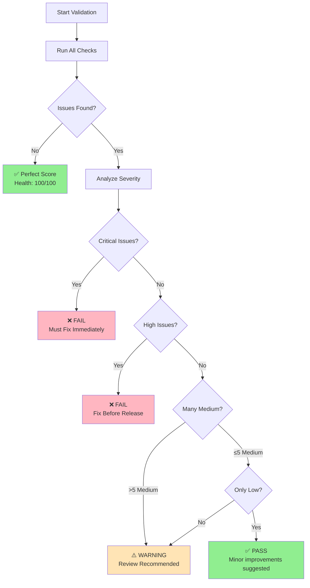

# GUI Validation Flow - Sequence Diagram

This diagram shows the **GUI Validation** flow implemented according to ISTQB CT-AI 11.6.2.

## Diagrama de Secuencia

```mermaid
sequenceDiagram
    participant Test as Test Runner
    participant Validator as GUIValidator
    participant Driver as WebDriver
    participant DOM as Page DOM
    participant Report as Issue Reporter
    
    Note over Test,Report: GUI Validation Flow (ISTQB CT-AI 11.6.2)
    
    Test->>Driver: Navigate to URL
    Driver-->>Test: Page loaded
    
    Test->>Validator: validate_page(driver)
    
    Note over Validator: Initialize validation
    Validator->>Validator: Clear previous issues[]
    
    Note over Validator,DOM: Check 1: Broken Images
    
    Validator->>Driver: find_elements(By.TAG_NAME, "img")
    Driver->>DOM: Query all <img> elements
    DOM-->>Driver: List of image elements
    Driver-->>Validator: Image elements
    
    loop For each image
        Validator->>Driver: Execute script: get naturalWidth
        Driver->>DOM: Read image.naturalWidth
        DOM-->>Driver: Width value
        Driver-->>Validator: naturalWidth
        
        alt naturalWidth == 0
            Validator->>Report: Log broken_image issue (HIGH)
            Note right of Report: Image failed to load
        end
    end
    
    Note over Validator,DOM: Check 2: Invisible Elements
    
    Validator->>Driver: find_elements(By.TAG_NAME, "button")
    Driver-->>Validator: Button elements
    
    loop For each button
        Validator->>Driver: element.is_displayed()
        Driver->>DOM: Check computed styles & visibility
        DOM-->>Driver: true/false
        Driver-->>Validator: Display status
        
        alt Not displayed
            Validator->>Report: Log invisible_element issue (MEDIUM)
            Note right of Report: Button present but not visible
        end
    end
    
    Note over Validator,DOM: Check 3: Overlapping Elements
    
    Validator->>Driver: find_elements(By.CSS, "interactive elements")
    Driver-->>Validator: Interactive elements
    
    loop For each element
        Validator->>Driver: element.location & element.size
        Driver->>DOM: Get bounding rect
        DOM-->>Driver: {x, y, width, height}
        Driver-->>Validator: Bounding box
        Validator->>Validator: Store in boxes[]
    end
    
    Validator->>Validator: Check all box pairs for overlap
    
    loop For each overlapping pair
        Validator->>Report: Log overlapping_elements issue (MEDIUM)
        Note right of Report: Interactive elements overlap
    end
    
    Note over Validator,DOM: Check 4: Accessibility
    
    Validator->>Driver: find_elements(By.TAG_NAME, "img")
    Driver-->>Validator: Images
    
    loop For each image
        Validator->>Driver: element.get_attribute("alt")
        Driver->>DOM: Read alt attribute
        DOM-->>Driver: Alt text or null
        Driver-->>Validator: Alt value
        
        alt alt is empty or null
            Validator->>Report: Log missing_alt_text issue (MEDIUM)
            Note right of Report: Accessibility violation
        end
    end
    
    Validator->>Driver: find_elements(By.TAG_NAME, "input")
    Driver-->>Validator: Input elements
    
    loop For each input (non-hidden)
        Validator->>Driver: element.get_attribute("id")
        Driver-->>Validator: Input ID
        
        alt Has ID
            Validator->>Driver: find_element(By.CSS, "label[for='id']")
            Driver->>DOM: Query for matching label
            
            alt No label found
                DOM-->>Driver: NoSuchElementException
                Driver-->>Validator: No label
                Validator->>Report: Log missing_label issue (MEDIUM)
                Note right of Report: Form input without label
            end
        end
    end
    
    Note over Validator,DOM: Check 5: Button Sizes
    
    Validator->>Driver: find_elements(By.TAG_NAME, "button")
    Driver-->>Validator: Buttons
    
    loop For each visible button
        Validator->>Driver: element.size
        Driver->>DOM: Get computed dimensions
        DOM-->>Driver: {width, height}
        Driver-->>Validator: Size
        
        alt width < min_size OR height < min_size
            Validator->>Report: Log small_touch_target issue (MEDIUM)
            Note right of Report: Touch target too small<br/>for mobile users
        end
    end
    
    Note over Validator,DOM: Check 6: Text Readability
    
    Validator->>Driver: find_elements(By.CSS, "p, span, div, h1...")
    Driver-->>Validator: Text elements (first 50)
    
    loop For each text element
        Validator->>Driver: Execute script: getComputedStyle(element).fontSize
        Driver->>DOM: Get computed font size
        DOM-->>Driver: Font size value
        Driver-->>Validator: fontSize
        
        alt fontSize < min_font_size
            Validator->>Report: Log tiny_text issue (LOW)
            Note right of Report: Text too small to read
        end
    end
    
    Note over Validator,DOM: Check 7: Form Labels
    
    Validator->>Driver: find_elements(By.TAG_NAME, "form")
    Driver-->>Validator: Forms
    
    loop For each form
        Validator->>Driver: form.find_elements(By.CSS, "input, textarea, select")
        Driver-->>Validator: Form inputs
        
        loop For each input
            Validator->>Driver: Get id, aria-label, placeholder
            Driver-->>Validator: Attributes
            
            alt No label, aria-label, or placeholder
                Validator->>Report: Log unlabeled_input issue (HIGH)
                Note right of Report: Critical accessibility issue
            end
        end
    end
    
    Note over Validator: Compile Results
    
    Validator->>Validator: Calculate summary statistics
    Validator->>Validator: Group by severity
    Validator->>Validator: Generate recommendations
    
    Validator-->>Test: Return issues[]
    
    Note over Test: Analyze Results
    
    Test->>Validator: get_summary()
    Validator-->>Test: Summary with counts by severity
    
    Test->>Validator: print_report()
    Validator->>Report: Generate formatted report
    
    Report-->>Test: Display report with:
    
    Note over Report: Report Contents:<br/>- Total issues<br/>- Issues by severity<br/>- Detailed issue list<br/>- Suggestions for fixes<br/>- Pass/Fail determination
    
    alt Critical or High issues found
        Test->>Test: ❌ Assert fails
        Test-->>Test: Test FAILED - Issues need fixing
    else Only Medium/Low issues
        Test->>Test: ⚠️  Warning logged
        Test-->>Test: Test PASSED with warnings
    else No issues
        Test->>Test: ✅ Assert passes
        Test-->>Test: Test PASSED - Page healthy
    end
```



## Tipos de Validaciones

### 1. Broken Images
```python
Issue Type: broken_image
Severity: HIGH
Detection: naturalWidth == 0
Impact: Users see broken image icons
Fix: Verify image URL and accessibility
```

### 2. Invisible Elements
```python
Issue Type: invisible_element
Severity: MEDIUM
Detection: element.is_displayed() == false
Impact: Users cannot interact with elements
Fix: Check CSS display, visibility, z-index
```

### 3. Overlapping Elements
```python
Issue Type: overlapping_elements
Severity: MEDIUM
Detection: Bounding boxes intersect
Impact: Click targets ambiguous
Fix: Adjust positioning or z-index
```

### 4. Missing Alt Text
```python
Issue Type: missing_alt_text
Severity: MEDIUM
Detection: alt attribute empty or null
Impact: Screen readers cannot describe image
Fix: Add descriptive alt text
```

### 5. Missing Form Labels
```python
Issue Type: missing_label / unlabeled_input
Severity: MEDIUM to HIGH
Detection: No label, aria-label, or placeholder
Impact: Accessibility failure, confusing for users
Fix: Add <label> or aria-label
```

### 6. Small Touch Targets
```python
Issue Type: small_touch_target
Severity: MEDIUM
Detection: width < 44px OR height < 44px
Impact: Difficult to tap on mobile
Fix: Increase button size to 44x44px minimum
```

### 7. Tiny Text
```python
Issue Type: tiny_text
Severity: LOW
Detection: fontSize < 12px
Impact: Hard to read, especially on mobile
Fix: Increase font size to 12px+
```

## Example Report

```text
======================================================================
GUI VALIDATION REPORT
======================================================================

Total Issues: 8
  Critical: 0
  High:     2
  Medium:   4
  Low:      2

----------------------------------------------------------------------
DETAILED ISSUES:
----------------------------------------------------------------------

1. 🟠 [HIGH] broken_image
   Element: img[src='images/logo.png']
   Issue: Image failed to load: images/logo.png
   💡 Suggestion: Verify image URL and accessibility

2. 🟡 [MEDIUM] missing_label
   Element: input#email
   Issue: Form input missing associated label: email
   💡 Suggestion: Add <label> element with for attribute

3. 🟡 [MEDIUM] small_touch_target
   Element: button: Submit
   Issue: Button too small (32x28px): Submit
   💡 Suggestion: Increase size to at least 44x44px

4. 🟢 [LOW] tiny_text
   Element: span: Copyright 2025
   Issue: Text too small (10px): Copyright 2025
   💡 Suggestion: Increase font size to at least 12px

======================================================================
```

## Health Score Calculation

```python
health_score = 100
health_score -= critical_issues * 25
health_score -= high_issues * 10
health_score -= medium_issues * 5
health_score -= low_issues * 1
health_score = max(0, health_score)

# Example: 2 high, 4 medium, 2 low
# = 100 - (2*10) - (4*5) - (2*1)
# = 100 - 20 - 20 - 2
# = 58/100 (Needs Improvement)
```

## Configurable Validation Criteria

```yaml
gui_validation:
  min_contrast_ratio: 4.5    # WCAG AA standard
  min_button_size: 44        # Touch-friendly (iOS/Android)
  min_font_size: 12          # Readable text
  
  rules:
    - name: "broken_images"
      enabled: true
      severity: "high"
    
    - name: "invisible_elements"
      enabled: true
      severity: "medium"
    
    - name: "overlapping_elements"
      enabled: true
      severity: "medium"
```

## Example Usage

```python
from utils.gui_validator import GUIValidator

# Create validator with custom rules
validator = GUIValidator(
    min_contrast_ratio=4.5,
    min_button_size=44,
    min_font_size=12
)

# Validate page
driver.get("https://example.com")
issues = validator.validate_page(driver)

# Get summary
summary = validator.get_summary()
print(f"Total issues: {summary['total_issues']}")
print(f"Critical: {summary['by_severity']['critical']}")

# Print detailed report
validator.print_report()

# Calcular health score
health_score = 100 - (
    summary['by_severity']['critical'] * 25 +
    summary['by_severity']['high'] * 10 +
    summary['by_severity']['medium'] * 5 +
    summary['by_severity']['low'] * 1
)

print(f"Page Health: {health_score}/100")
```

## Flujo de Decisión



## Referencia ISTQB CT-AI

> **11.6.2 Using AI to Test the GUI**
>
> "ML models can be used to determine the acceptability of user interface screens (e.g., by using heuristics and supervised learning)."
>
> "Tools based on these models can identify incorrectly rendered elements, determine whether some objects are inaccessible or hard to detect, and detect various other issues with the visual appearance of the GUI."
