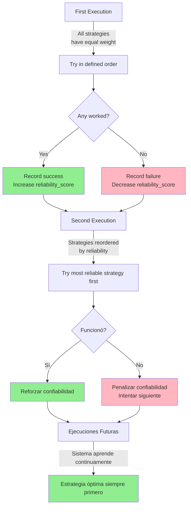
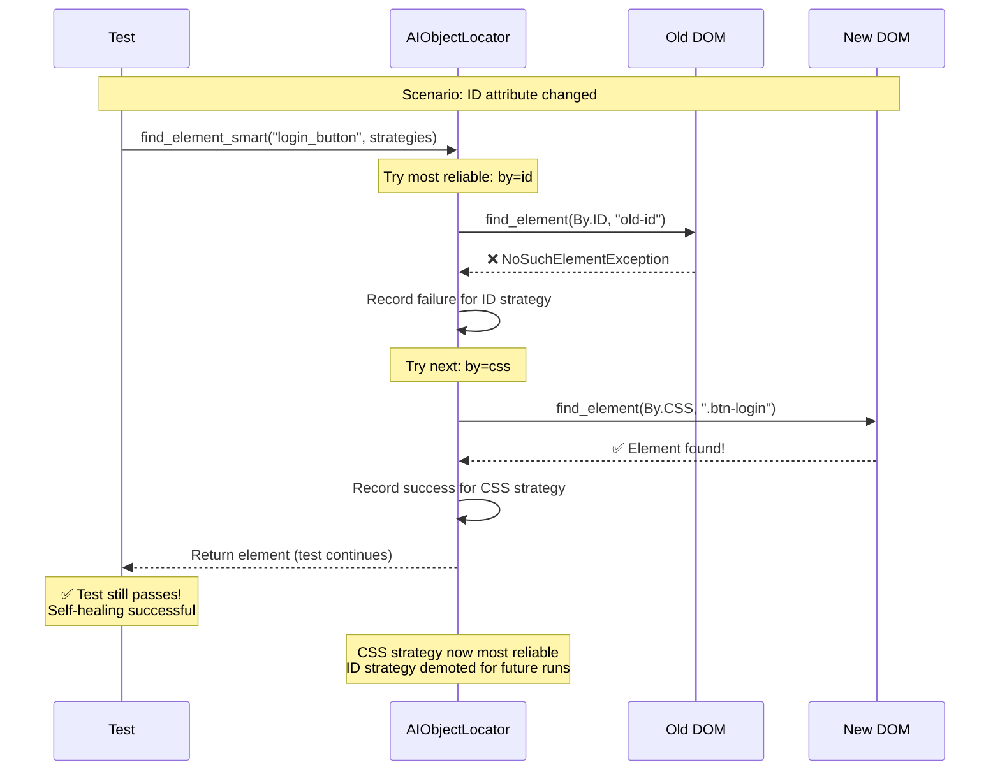

# Self-Healing Test Flow - Sequence Diagram

This diagram shows the **Self-Healing Tests** flow implemented according to ISTQB CT-AI 11.6.1.

## Diagrama de Secuencia

```mermaid
sequenceDiagram
    participant Test as Test Runner
    participant Locator as AIObjectLocator
    participant History as Locator History
    participant Driver as WebDriver
    participant DOM as Page DOM
    
    Note over Test,DOM: Self-Healing Test Flow (ISTQB CT-AI 11.6.1)
    
    Test->>Driver: Navigate to URL
    Driver-->>Test: Page loaded
    
    Test->>Locator: find_element_smart(driver, "login_button", strategies)
    
    Note over Locator: Load Historical Data
    Locator->>History: Load history for "login_button"
    History-->>Locator: Strategy success/failure data
    
    Note over Locator: Prepare & Sort Strategies
    
    loop For each strategy
        Locator->>Locator: Calculate reliability_score
        Note right of Locator: score = success_rate*0.7<br/>+ time_score*0.2<br/>+ recency_score*0.1
    end
    
    Locator->>Locator: Sort strategies by reliability_score
    
    Note over Locator: Strategies now ordered:<br/>1. Most reliable first<br/>2. Least reliable last
    
    Note over Locator,DOM: Try Each Strategy (Ordered by Reliability)
    
    loop For each retry attempt (max 3)
        loop For each strategy (best to worst)
            Locator->>Driver: find_element(by, value)
            
            alt Element Found
                Driver->>DOM: Locate element in DOM
                DOM-->>Driver: Element reference
                
                Driver->>DOM: Check is_displayed()
                DOM-->>Driver: true/false
                
                Driver->>DOM: Check is_enabled()
                DOM-->>Driver: true/false
                
                alt Element is visible & enabled
                    Driver-->>Locator: ✅ Element found!
                    
                    Note over Locator: Record Success
                    Locator->>Locator: Update success_count
                    Locator->>Locator: Update avg_response_time
                    Locator->>Locator: Update last_used timestamp
                    
                    Locator->>History: Save updated statistics
                    History-->>Locator: Saved
                    
                    Locator-->>Test: Return WebElement
                    
                    Note over Test: ✅ Test continues successfully
                    
                else Element not interactable
                    Driver-->>Locator: Element found but not usable
                    Note over Locator: Record Failure
                    Locator->>Locator: Increment failure_count
                    Locator->>History: Update statistics
                end
                
            else Element Not Found (NoSuchElementException)
                Driver-->>Locator: ❌ Not found with this strategy
                
                Note over Locator: Record Failure
                Locator->>Locator: Increment failure_count
                Locator->>History: Update statistics
                History-->>Locator: Saved
                
                Note over Locator: Try next strategy...
            end
        end
        
        alt Element found
            Note over Locator: Break retry loop - Success!
        else No strategy worked
            Note over Locator: Wait 1 second before retry
            Locator->>Locator: sleep(1)
        end
    end
    
    alt All strategies exhausted
        Locator-->>Test: Return None (element not found)
        
        Note over Test: Test Decision Point
        Test->>Test: ❌ Assert element is not None
        Test-->>Test: Test FAILED - Element not locatable
    end
    
    Note over Locator,History: Learning Over Time
    
    Note over History: Strategy Statistics Example:<br/>{<br/>  "login_button": [<br/>    {<br/>      "by": "id", "value": "btn-login",<br/>      "success": 98, "failure": 2,<br/>      "success_rate": 0.98,<br/>      "reliability": 0.96<br/>    },<br/>    {<br/>      "by": "css", "value": ".btn-login",<br/>      "success": 5, "failure": 10,<br/>      "success_rate": 0.33,<br/>      "reliability": 0.31<br/>    }<br/>  ]<br/>}
```



## Cálculo del Reliability Score

```python
reliability_score = (
    success_rate * 0.70 +     # 70% basado en tasa de éxito
    time_score * 0.20 +       # 20% basado en velocidad
    recency_score * 0.10      # 10% basado en uso reciente
)

donde:
    success_rate = success_count / (success_count + failure_count)
    time_score = 1.0 / (1.0 + avg_response_time)
    recency_score = 1.0 / (1.0 + days_since_last_use)
```

## Flujo de Aprendizaje



## Evolution Example

### Run 1 - No History
```
Strategies (equal priority):
1. by=id, value=login-btn         [reliability: 0.50]
2. by=name, value=login           [reliability: 0.50]
3. by=css, value=.btn-login       [reliability: 0.50]
4. by=xpath, value=//button[@id]  [reliability: 0.50]

Result: Strategy #3 (css) worked ✅
```

### Run 2 - After 1 Success
```
Strategies (reordered by reliability):
1. by=css, value=.btn-login       [reliability: 0.70] ⭐ PROMOTED
2. by=id, value=login-btn         [reliability: 0.45]
3. by=name, value=login           [reliability: 0.45]
4. by=xpath, value=//button[@id]  [reliability: 0.45]

Result: Strategy #1 (css) tried first, worked ✅
```

### Run 10 - After Multiple Executions
```
Strategies (learned optimal order):
1. by=css, value=.btn-login       [reliability: 0.95] ⭐⭐⭐ HIGHLY RELIABLE
2. by=xpath, value=//button[@id]  [reliability: 0.75] ⭐⭐ BACKUP
3. by=name, value=login           [reliability: 0.30]
4. by=id, value=login-btn         [reliability: 0.15] ❌ UNSTABLE

Result: Strategy #1 works immediately, fast execution ⚡
```

## Adapting to DOM Changes

### Scenario: Button ID Changed



## Code Example

```python
from utils.ai_object_locator import AIObjectLocator
from selenium.webdriver.common.by import By

# Create locator with persistent history
locator = AIObjectLocator(history_file="config/locator_history.json")

# Define multiple strategies
strategies = [
    {"by": "id", "value": "login-button"},
    {"by": "name", "value": "login"},
    {"by": "xpath", "value": "//button[contains(text(), 'Login')]"},
    {"by": "css_selector", "value": ".btn-login"},
    {"by": "class_name", "value": "login-btn"}
]

# Find element with AI
element = locator.find_element_smart(
    driver=driver,
    element_name="login_button",
    strategies=strategies,
    timeout=10,
    retry_count=3
)

if element:
    element.click()  # Test continues normally
    
# View learning statistics
locator.print_stats("login_button")
```

## Self-Healing Benefits

| Traditional Problem | Self-Healing Solution |
|---------------------|----------------------|
| ID changed → Test fails | Automatically tries another locator |
| Fragile XPath → Breaks frequently | Learns to avoid unstable XPath |
| Manual maintenance | Automatic adaptation |
| Flaky tests | Robust tests |
| High maintenance cost | Low maintenance |

## Referencia ISTQB CT-AI

> **11.6.1 Using AI to Test Through the GUI**
>
> "AI can be used to reduce the brittleness of this approach, by employing AI-based tools to identify the correct objects using various criteria (e.g., XPath, label, id, class, X/Y coordinates), and to choose the historically most stable identification criteria."
>
> "For example, the ID of a button in a particular area of the application may change with each release, and so the AI-based tool may assign a lower importance to this ID over time and place more reliance on other criteria."
