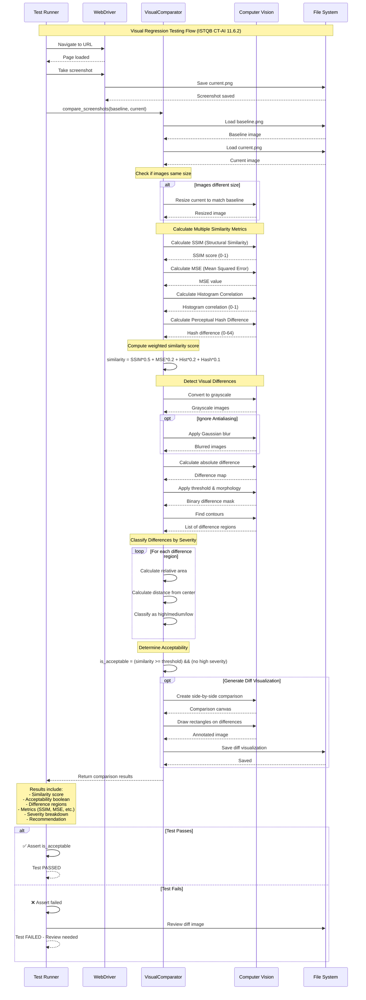

# Visual Testing Flow - Sequence Diagram

Este diagrama muestra el flujo completo del **Visual Regression Testing** implementado según ISTQB CT-AI 11.6.2.

## Diagrama de Secuencia



## Métricas Utilizadas

### 1. **SSIM (Structural Similarity Index)**
- Rango: 0 a 1 (1 = idéntico)
- Considera: luminancia, contraste, estructura
- Peso: 50% del score total

### 2. **MSE (Mean Squared Error)**
- Rango: 0 a ∞ (0 = idéntico)
- Mide diferencias pixel por pixel
- Peso: 20% del score total

### 3. **Histogram Correlation**
- Rango: 0 a 1 (1 = idéntico)
- Compara distribución de colores
- Peso: 20% del score total

### 4. **Perceptual Hash**
- Rango: 0 a 64 bits diferentes
- Hash visual de la imagen
- Peso: 10% del score total

## Clasificación de Severidad

```
┌──────────────────────────────────────────┐
│ Severity Classification Logic            │
├──────────────────────────────────────────┤
│ HIGH:                                     │
│  • Area > 10% of screen                  │
│  • Distance from center < 30%            │
│                                          │
│ MEDIUM:                                  │
│  • Area > 1% of screen                   │
│  • Distance from center < 60%            │
│                                          │
│ LOW:                                     │
│  • Smaller areas                         │
│  • Further from center                   │
└──────────────────────────────────────────┘
```

## Ejemplo de Uso

```python
from utils.visual_comparator import VisualComparator

# Crear comparador con umbral de 95%
comparator = VisualComparator(
    threshold=0.95,
    pixel_tolerance=10,
    ignore_antialiasing=True
)

# Comparar screenshots
result = comparator.compare_screenshots(
    baseline_path="screenshots/baseline/page.png",
    current_path="screenshots/current/page.png",
    diff_output_path="screenshots/diff/page_diff.png"
)

# Analizar resultados
print(f"Similarity: {result['similarity_score']:.2%}")
print(f"Acceptable: {result['is_acceptable']}")
print(f"High severity issues: {result['severity_breakdown']['high']}")
print(f"Recommendation: {result['recommendation']}")
```

## Decisión de Aceptabilidad

```python
is_acceptable = (
    similarity_score >= threshold AND
    high_severity_differences == 0
)
```

La imagen se considera **aceptable** si:
1. El score de similitud está por encima del threshold (default: 0.95)
2. No hay diferencias de alta severidad

## Referencia ISTQB CT-AI

> **11.6.2 Using AI to Test the GUI**
> 
> "AI-based computer vision can be used to compare images (e.g., screenshots) to identify unintended changes to the layout, the size, position, color, font or other visible attributes of objects."
>
> "Such AI-based tools can also be used to support testing for compatibility on different browsers, devices or platforms..."
