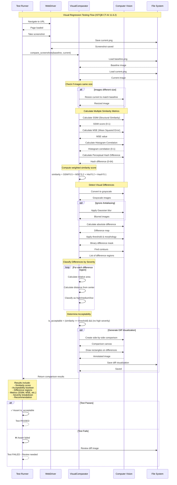

# Visual Testing Flow - Sequence Diagram

This diagram shows the complete **Visual Regression Testing** flow implemented according to ISTQB CT-AI 11.6.2.

## Sequence Diagram



## Metrics Used

### 1. **SSIM (Structural Similarity Index)**
- Range: 0 to 1 (1 = identical)
- Considers: luminance, contrast, structure
- Weight: 50% of total score

### 2. **MSE (Mean Squared Error)**
- Range: 0 to ∞ (0 = identical)
- Measures pixel by pixel differences
- Weight: 20% of total score

### 3. **Histogram Correlation**
- Range: 0 to 1 (1 = identical)
- Compares color distribution
- Weight: 20% of total score

### 4. **Perceptual Hash**
- Range: 0 to 64 different bits
- Visual hash of the image
- Weight: 10% of total score

## Severity Classification

```
┌──────────────────────────────────────────┐
│ Severity Classification Logic            │
├──────────────────────────────────────────┤
│ HIGH:                                     │
│  • Area > 10% of screen                  │
│  • Distance from center < 30%            │
│                                          │
│ MEDIUM:                                  │
│  • Area > 1% of screen                   │
│  • Distance from center < 60%            │
│                                          │
│ LOW:                                     │
│  • Smaller areas                         │
│  • Further from center                   │
└──────────────────────────────────────────┘
```

## Example Usage

```python
from utils.visual_comparator import VisualComparator

# Create comparator with 95% threshold
comparator = VisualComparator(
    threshold=0.95,
    pixel_tolerance=10,
    ignore_antialiasing=True
)

# Compare screenshots
result = comparator.compare_screenshots(
    baseline_path="screenshots/baseline/page.png",
    current_path="screenshots/current/page.png",
    diff_output_path="screenshots/diff/page_diff.png"
)

# Analyze results
print(f"Similarity: {result['similarity_score']:.2%}")
print(f"Acceptable: {result['is_acceptable']}")
print(f"High severity issues: {result['severity_breakdown']['high']}")
print(f"Recommendation: {result['recommendation']}")
```

## Acceptability Decision

```python
is_acceptable = (
    similarity_score >= threshold AND
    high_severity_differences == 0
)
```

The image is considered **acceptable** if:
1. The similarity score is above the threshold (default: 0.95)
2. There are no high severity differences

## ISTQB CT-AI Reference

> **11.6.2 Using AI to Test the GUI**
> 
> "AI-based computer vision can be used to compare images (e.g., screenshots) to identify unintended changes to the layout, the size, position, color, font or other visible attributes of objects."
>
> "Such AI-based tools can also be used to support testing for compatibility on different browsers, devices or platforms..."
